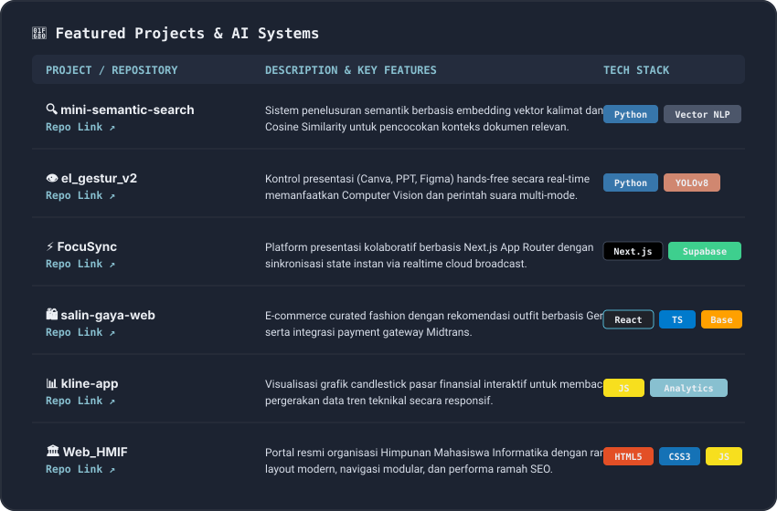
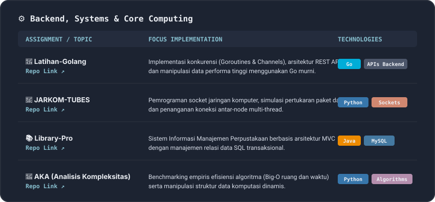
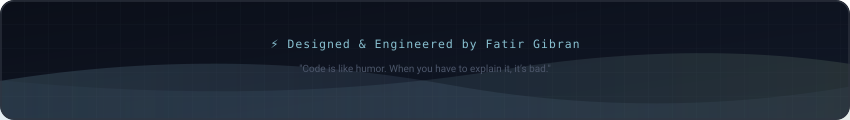

<!-- HEADER BANNER WIDGET -->

  

<!-- DYNAMIC TYPING ANIMATION -->

  

<!-- SOCIAL BADGES -->

  
  
  
  

 

<!-- TECH STACK ICONS -->

  

 

<!-- FEATURED PROJECTS CARD (SVG) -->

  

 

<!-- ACADEMIC & SYSTEMS CARD (SVG) -->

  

 

<!-- GITHUB STREAK METRICS -->

  

<!-- STATS SUMMARY PILLS -->

  
  
  
  

 

<!-- FOOTER BANNER WIDGET -->

  

