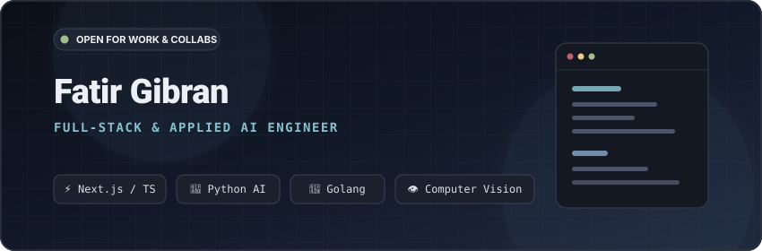

<!-- HEADER BANNER WIDGET -->

  

<!-- DYNAMIC TYPING SVG -->

  

<!-- SOCIAL BADGES -->

  
  
  
  

---

### 💫 About & Focus Areas

<table align="center" width="100%">
  <tr>
    <td width="70%" valign="top">
      
Halo! Saya <b>Fatir Gibran</b>, mahasiswa Teknik Informatika yang berfokus pada perancangan <b>Modern Web Architecture</b>, pemrosesan backend performa tinggi, dan implementasi terapan <b>Artificial Intelligence & Computer Vision</b>.

      
Berpengalaman mengeksekusi proyek end-to-end: mulai dari eksplorasi semantic search dan computer vision, hingga sistem antarmuka modern yang terintegrasi cloud database dan payment gateway.

      <ul>
        <li>🌱 <b>Current Stack Focus:</b> Go (Golang), Python, Next.js / TypeScript, dan arsitektur event-driven / realtime.</li>
        <li>💡 <b>Interest:</b> Applied Machine Learning, Vector & Semantic Search, Microservices, and UI/UX Ergonomics.</li>
        <li>📫 <b>Opportunities:</b> Terbuka untuk software engineering internships, open-source research, dan tech collaboration.</li>
      </ul>
    </td>
    <td width="30%" align="center" valign="middle">
      
    </td>
  </tr>
</table>

---

### 🛠️ Tech Stack & Ecosystem

<table width="100%">
  <tr>
    <td align="left" valign="top" width="33%">
      <b>🌐 Frontend & Interfaces</b>  
      
    </td>
    <td align="left" valign="top" width="33%">
      <b>⚙️ Backend, AI & Languages</b>  
      
    </td>
    <td align="left" valign="top" width="33%">
      <b>🚀 DevOps & Environments</b>  
      
    </td>
  </tr>
</table>

---

### 🧠 AI, Machine Learning & Vision Systems

<table width="100%">
  <thead>
    <tr>
      <th width="30%">Repository</th>
      <th width="45%">Deskripsi & Kemampuan Teknis</th>
      <th width="25%">Tech Stack</th>
    </tr>
  </thead>
  <tbody>
    <tr>
      <td>
        <b>🔍 mini-semantic-search</b> 
        <a href="https://github.com/Fatirrr08/mini-semantic-search" target="_blank"><b>Lihat Repositori ↗</b></a>
      </td>
      <td>
        Sistem penelusuran semantik berbasis embedding vektor kalimat dan cosine similarity untuk pencocokan konteks dokumen yang relevan.
      </td>
      <td>
        
        
      </td>
    </tr>
    <tr>
      <td>
        <b>👁️ el_gestur_v2</b> 
        <a href="https://github.com/aariffaqiih/el_gestur_v2" target="_blank"><b>Lihat Repositori ↗</b></a>
      </td>
      <td>
        Sistem kontrol presentasi (Canva, PowerPoint, Figma) secara <i>hands-free</i> dengan deteksi gestur real-time dan perintah suara multi-mode.
      </td>
      <td>
        
        
        
      </td>
    </tr>
    <tr>
      <td>
        <b>📊 kline-app</b> 
        <a href="https://github.com/Fatirrr08/kline-app" target="_blank"><b>Lihat Repositori ↗</b></a>
      </td>
      <td>
        Aplikasi visualisasi analisis pasar dan chart interaktif candlestick terstruktur untuk pemantauan data finansial teknikal.
      </td>
      <td>
        
        
      </td>
    </tr>
  </tbody>
</table>

---

### 🌐 Full-Stack & Interactive Applications

<table width="100%">
  <thead>
    <tr>
      <th width="30%">Repository</th>
      <th width="45%">Deskripsi & Fitur Kunci</th>
      <th width="25%">Tech Stack</th>
    </tr>
  </thead>
  <tbody>
    <tr>
      <td>
        <b>⚡ FocuSync</b> 
        <a href="https://github.com/Fatirrr08/FocuSync" target="_blank"><b>Lihat Repositori ↗</b></a>
      </td>
      <td>
        Aplikasi presentasi & produktivitas kolaboratif dengan sinkronisasi state instan via realtime cloud service.
      </td>
      <td>
        
        
        
      </td>
    </tr>
    <tr>
      <td>
        <b>🛍️ salin-gaya-web</b> 
        <a href="https://github.com/Fatirrr08/salin-gaya-web" target="_blank"><b>Lihat Repositori ↗</b></a>
      </td>
      <td>
        Platform e-commerce katalog outfit cerdas yang memadukan asisten rekomendasi gaya cerdas dengan payment gateway transaksional.
      </td>
      <td>
        
        
        
      </td>
    </tr>
    <tr>
      <td>
        <b>🩺 Monitoring-Kesehatan</b> 
        <a href="https://github.com/Fatirrr08/Monitoring-Kesehatan" target="_blank"><b>Lihat Repositori ↗</b></a>
      </td>
      <td>
        Platform dashboard pemantauan kondisi dan rekam data kesehatan terpadu dengan penyajian metrik responsif.
      </td>
      <td>
        
        
      </td>
    </tr>
    <tr>
      <td>
        <b>🏛️ Web_HMIF</b> 
        <a href="https://github.com/Fatirrr08/Web_HMIF" target="_blank"><b>Lihat Repositori ↗</b></a>
      </td>
      <td>
        Website profil resmi dan sentralisasi informasi himpunan mahasiswa dengan tata letak modular dan arsitektur antarmuka modern.
      </td>
      <td>
        
        
        
      </td>
    </tr>
  </tbody>
</table>

---

### ⚙️ Backend, Systems & Computing Fundamentals

<table width="100%">
  <thead>
    <tr>
      <th width="30%">Repository</th>
      <th width="45%">Fokus Implementasi</th>
      <th width="25%">Teknologi</th>
    </tr>
  </thead>
  <tbody>
    <tr>
      <td>
        <b>🐹 Latihan-Golang</b> 
        <a href="https://github.com/Fatirrr08/Latihan-Golang" target="_blank"><b>Lihat Repositori ↗</b></a>
      </td>
      <td>
        Eksplorasi konkurensi (Goroutines & Channels), pembuatan REST API idiomatik, dan manipulasi data berkecepatan tinggi dengan Go.
      </td>
      <td>
        
        
      </td>
    </tr>
    <tr>
      <td>
        <b>🔌 JARKOM-TUBES</b> 
        <a href="https://github.com/Fatirrr08/JARKOM-TUBES" target="_blank"><b>Lihat Repositori ↗</b></a>
      </td>
      <td>
        Simulasi socket programming jaringan komputer, protokol komunikasi data, dan penanganan koneksi antar-host multi-thread.
      </td>
      <td>
        
        
      </td>
    </tr>
    <tr>
      <td>
        <b>📚 Library-Pro</b> 
        <a href="https://github.com/Fatirrr08/Library-Pro" target="_blank"><b>Lihat Repositori ↗</b></a>
      </td>
      <td>
        Sistem Informasi Manajemen Perpustakaan berbasis arsitektur <code>MVC</code> terintegrasi skema basis data relasional SQL transaksional.
      </td>
      <td>
        
        
      </td>
    </tr>
    <tr>
      <td>
        <b>📐 AKA (Analisis Algoritma)</b> 
        <a href="https://github.com/Fatirrr08/AKA" target="_blank"><b>Lihat Repositori ↗</b></a>
      </td>
      <td>
        Komparasi empiris performa efisiensi algoritma (Time & Space Complexity) dan benchmarking struktur data komputasi.
      </td>
      <td>
        
        
      </td>
    </tr>
  </tbody>
</table>

---

### 📊 GitHub Productivity & Metrics

  

  

  

  <i>"Code is like humor. When you have to explain it, it’s bad."</i>

